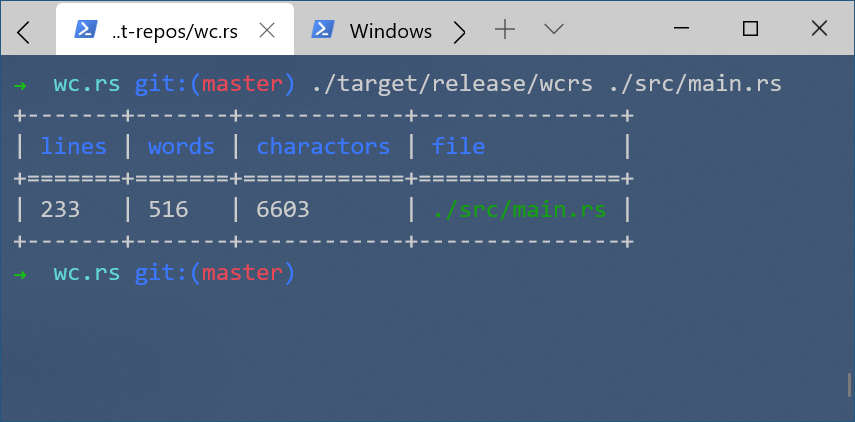

# wc.rs
ws impl with Rust

## Installation & Usage

```bash
git clone https://github.com/PrivateRookie/wc.rs.git

cd wc.rs

cargo install .

wcrs --help

wc.rs 0.1.0
PrivateRookie <996514515@qq.com>
wc impl with Rust

USAGE:
    wcrs [FLAGS] <FILE>...

FLAGS:
    -m, --chars       Prints the character counts
    -h, --help        Prints help information
    -l, --lines       Prints the new line counts
        --no-color    Disable colorful output
        --no-sep      Disable colorful output
    -V, --version     Prints version information
    -w, --words       Prints the words counts

ARGS:
    <FILE>...    File path(s) to run wc
```

## Sample

```bash
wcrs ./src/main.rs
```


